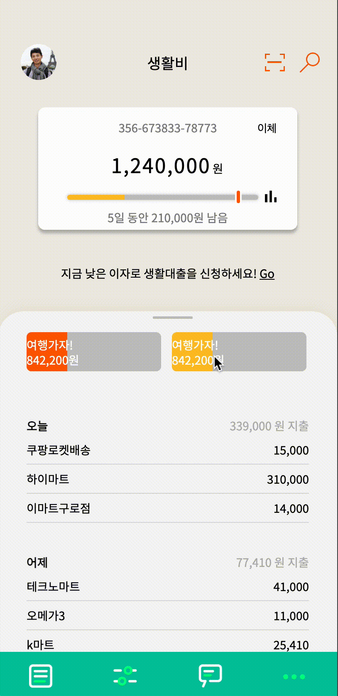
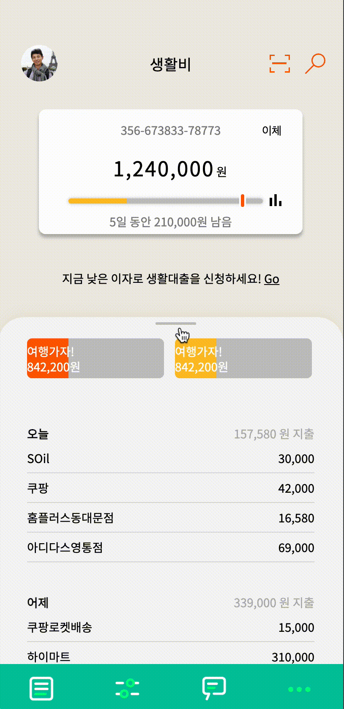
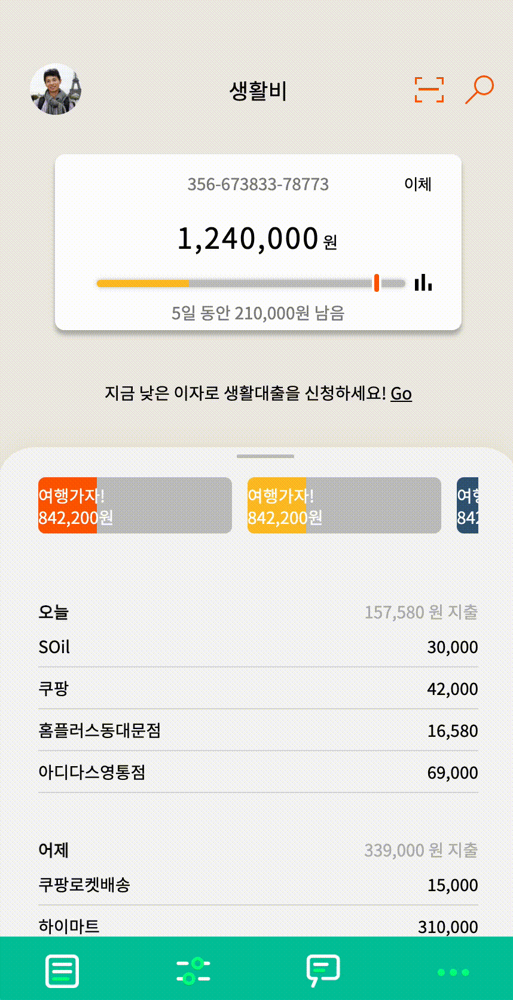
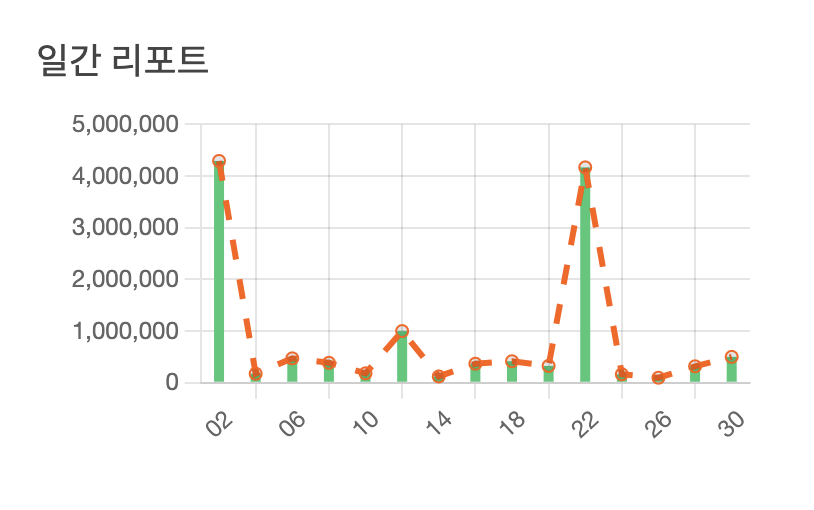
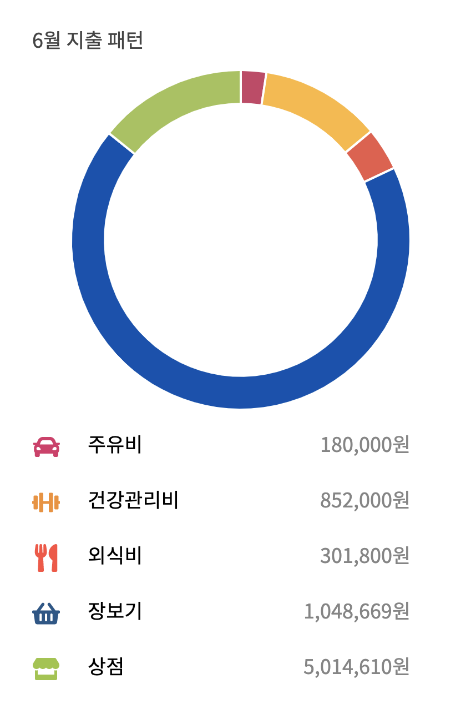

# KDT Bank App

💵 지출에 대한 정보를 받아와서 날짜 별 지출 기록 및 차트를 보여주는 웹 어플리케이션

배포 : [https://jayoonkoo.github.io/KDT-banking-app/](https://jayoonkoo.github.io/KDT-banking-app/)

### 사용 기술

<p align='center'>
    
    
    
    
    
</p>

<br />

## 실행 환경 및 실행

화면을 간단하게 꾸미는 토이 프로젝트였기 때문에 VSCode에 Live Server 기능을 활요했다.

Vscode에 Live Server 익스텐션을 설치한 이후에 index.html 파일을 열고

- `cmd + L cmd + O`
  를 하거나
- 우클릭 후 `Open With Live Server`를 클릭하면 된다.

모바일 화면을 기준으로 적응형으로 구성하였기 때문에 화면을 넓게 해도 좋으나 Width를 400px로 맞추기를 권장한다.

<br />

## 구현

- 자바스크립트를 사용하여 구현했다.
- 서버에서 지출에 대한 데이터를 받아와서 UI를 그리는 상황을 만들기 위해서 [https://syoon0624.github.io/json/test.json](https://syoon0624.github.io/json/test.json) 에 데이터를 fetch를 이용하여 받아 왔다.

```json
//https://syoon0624.github.io/json/test.json
{
  "bankList": [
    {
      "date": "2021-09-01",
      "income": "in",
      "classify": "",
      "history": "용돈",
      "price": 20000
    },
    {
      "date": "2021-09-01",
      "income": "out",
      "classify": "health",
      "history": "샐러드",
      "price": 10000
    },
		//...
}
```

- 저금통을 옆으로 스와이프 하는 UI를 구현하기 위해서 Swiper.js를 사용했다.
- 차트를 그리기 위해서 Chart.js를 사용하였다.
- reset.css를 사용하였다.
- JS는 페이지 별로 클래스를 사용하여 구현하였고, 공통으로 사용하는 Data 클래스를 따로 만들어서 기능을 구현하였다.
- CSS는 페이지 별로 스타일을 구성하고 공통으로 사용하는 common.css를 사용하여 공통 요소를 묶었다.
- git flow를 사용하여 기능별로 feature를 나누어서 develop에 머지하는 방법을 사용하였다.
- gitHub Pages를 사용하여 배포하였다.

<br/>

## 주요 기능

### 저금통 슬라이드

<p align="center"></p>

- swiper.js 사용하여 구현

### Daily 지출 현황 드래그

<p align="center"></p>

- DOM mounes 이벤트를 사용하여 구현

### Daily 지출현황 스크롤

<p align="center"></p>

- 조회한 날짜(현제 날짜) 기준 -1 ~ -10 일 까지의 결과를 리스트로 보여줌.
- Array 메서드를 골고루 사용해 보기 위해서 `forEach`, `map`, `filter`, `reduce` 를 적절히 사용함.

### Chart

<p align="center"></p>

- 지출관리 아이콘을 이용하여 지출관리 페이지로 이동

<p align="center"></p>

- Chart.js를 이용하여 구현
- 데이터 중에서 달 기준 데이터를 모으고 2일 씩 합산하여 계산.
- Array 메서드를 골고루 사용해 보기 위해서 `forEach`, `map`, `filter`, `reduce` 를 적절히 사용함.

<p align="center"></p>

- Chart.js를 이용하여 기준
- 카테고리별 월 지출을 보여줌.
